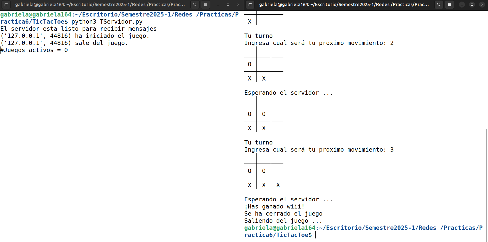

# Practica 6: Modelo cliente - servidor

Implementación del juego del gato (TIC TAC TOE) utilizando el modelo cliente - servidor. 

<table>
    <tr>
        <th>Equipo: DIA 2.0</th>
        <th>No de cuenta</th>
    </tr>
    <tr>
        <td>López Diego Gabriela</td>
        <td>318243485</td>
    </tr>
    <tr>
        <td>San Martín Macías Juan Daniel</td>
        <td>318181637</td>
    </tr>
    <tr>
        <td>Rivera Zavala Javier Alejandro</td>
        <td>311288876</td>
    </tr>
    <tr>
        <td>Ortiz Amaya Bruno Fernando</td>
        <td>318128676</td>
    </tr>
    <tr>
        <td>Juárez Ubaldo Juan Aurelio</td>
        <td>421095568</td>
    </tr>
</table>

Para ejecutar el juego TicTacToe (el juego del gato) hay que ejecutar en orden los siguientes comandos en terminales diferentes

1. python3 TServidor.py 
2. python3 TCliente.py 

El juego termina hasta que el usuario o el servidor gane. 

Nota: estaremos trabajando con 
* HOST = 'localhost'
* PORT = 12001

### Ejemplo de ejecución del juego del gato con un cliente

