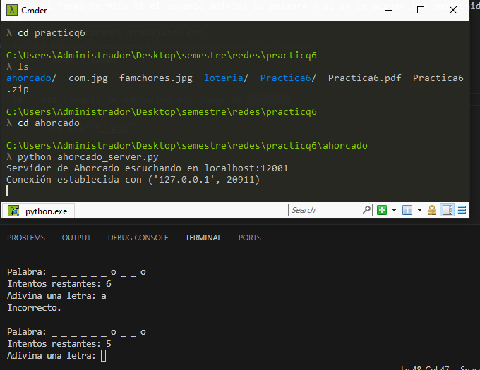

# Practica 6: Modelo cliente - servidor

Implementación del juego de ahorcado utilizando el modelo cliente - servidor. 

<table>
    <tr>
        <th>Equipo: DIA 2.0</th>
        <th>No de cuenta</th>
    </tr>
    <tr>
        <td>López Diego Gabriela</td>
        <td>318243485</td>
    </tr>
    <tr>
        <td>San Martín Macías Juan Daniel</td>
        <td>318181637</td>
    </tr>
    <tr>
        <td>Rivera Zavala Javier Alejandro</td>
        <td>311288876</td>
    </tr>
    <tr>
        <td>Ortiz Amaya Bruno Fernando</td>
        <td>318128676</td>
    </tr>
    <tr>
        <td>Juárez Ubaldo Juan Aurelio</td>
        <td>421095568</td>
    </tr>
</table>

Para ejecutar el juego de ahorcado hay que ejecutar en orden los siguientes comandos en terminales diferentes

1. python3 ahorcado_server.py 
2. python3 ahorcado_client.py 

El juego termina si el usuario adivina la palabra o si se le acaban las oportunidades

Nota: estaremos trabajando con 
* HOST = 'localhost'
* PORT = 12001

### Ejemplo de ejecución del juego de ahorcado

